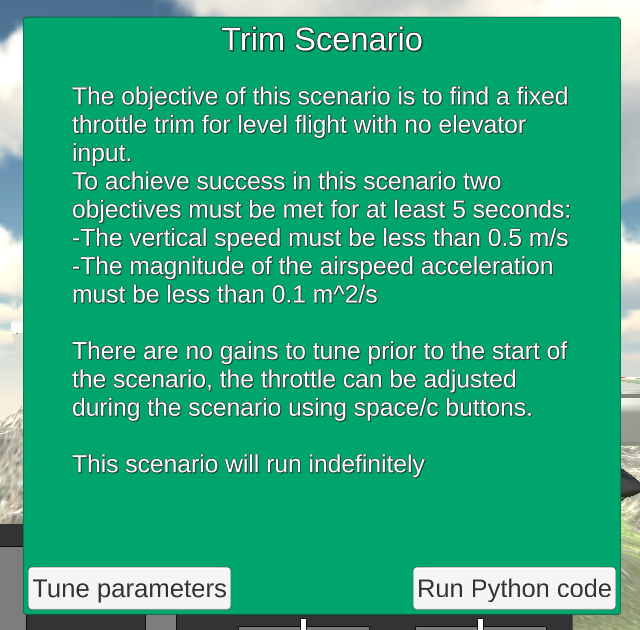
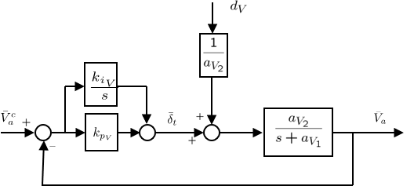
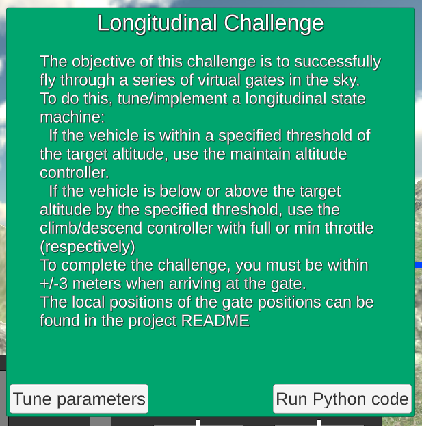
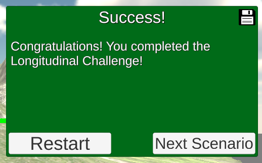
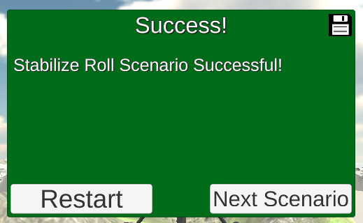
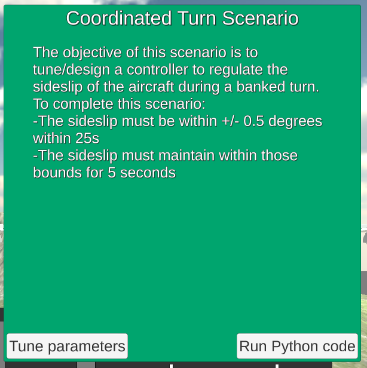

# Optional Project: Fixed-Wing Control

---

#### Fixed Wing Equations
* The original cheatsheet with equations for this project is [available online](https://www.overleaf.com/read/cvqmtzyhqjnj).
* A [rendered PDF](Fixed%20Wing%20Cheatsheet.pdf) has been included in this repository.

---

## Longitudinal Scenarios

### Scenario 1: Trim (Unity Only)

This scenario requires no coding or gains to tune -- just calibrating the values manually on the flight simulator.



The fixed throttle at **65.8%** eventually leads to success:


### Scenario 2: Altitude Hold

This scenario requires implementing the pitch hold and altitude hold controllers.  They are implemented as PD and PI controllers, respectively.


Tuning the process produces the following gains:

```
    # Gain parameters for pitch_loop PD controller
    self.kp_pitch = 4.0
    self.kp_q = 0.5

    # Gain parameters for altitude_loop PI controller
    self.kp_alt = 0.03
    self.ki_alt = 0.02
```

Of note, the official solution (and the tuning facility through Unity!) has a couple of implementation choices that cause a discrepancy between the tuning obtained in Unity and the initial implementation I had:
- A minimum pitch command is set to -10 degrees, different from the maximum pitch command of 30 degrees.
- A particular implementation of integrator anti-windup is used on the PI controller for attitude_loop:

```
    # Integrator anti-windup
    if(gain_i_alt != 0):
        self.alt_int = self.alt_int + dt/gain_i_alt*(pitch_cmd-pitch_cmd_unsat)
``` 
 
This implementation changes the integrated error to have been updated by a value equivalent to the error that would have been added if the commanded pitch had been its saturated value, rather than the unbounded one.

I implemented equivalent logic, for ease of tuning in future scenarios.


### Scenario 3: Airspeed Hold

This scenario requires implementing a PI controller for the airspeed hold.  




The code implementation is *almost* analogous to the implementation for the PI controller on the altitude loop -- we include a feed-forward term based on the throttle obtained for scenario 1.

Initial tuning provides the following gain values:

```
    # Gain parameters for airspeed_loop PI controller
    self.kp_speed = 0.4
    self.ki_speed = 0.3

    # Feed-forward term for throttle
    self.throttle_feedforward = 0.658
```

This works! ... after making sure that the code was running on a sufficiently fast computer, with the relevant graphic options set (i.e. disabling G-SYNC on my NVIDEA GTX card.)


### Scenario 4: Steady Climb

This requires yet another PI controller -- this time, for the climb state.


The Unity / manual tuning of parameters seems to not work at all for this scenario -- tuning had to be done by running the python script and changing its parameters there instead.

```
    # Gain parameters for airspeed_pitch_loop PI controller
    self.kp_speed_pitch = -0.2
    self.ki_speed_pitch = -0.2
```

These parameters are *negative*, unlike all of the gains seen so far -- the commanded pitch here is expected to be negative when climbing.


### Scenario 5: Longitudinal Challenge



This is relatively straightforward -- there are three potential states:

* If the altitude is too low, climb -- set throttle to max, and use airspeed_pitch_loop to control the pitch
* If the altitude is too high, 'climb down' -- set throttle to min, and use airspeed_pitch_loop to control the pitch
* Otherwise, control the throttle with airspeed_loop and the pitch with pitch_loop

Testing produced catastrophic crashes at threshold of 50m, the plane was not able to stay within the 'good enough' band with a threshold of 10m, and a threshold of 20m proved sufficient:

```
    # Threshold for switching behavior on altitude matching
    self.altitude_switch = 20
```




---

## Lateral / Directional Scenarios


### Scenario 6: Stabilized Roll Angle

One more PD controller; the intended roll speed is always 0.


Tuning allows for a controller with gains as aggressive as Kp = 10, Ki = 1; however, these are tuned against the default implementation, which is about twice as tight with its gains compared to the values I am tuning.  Accordingly, once I attempt to run with my own implementation, I find satisfactory values that are about half of that:

```
    # Gain parameters for roll_attitude_hold_loop PD controller
    self.kp_roll = 5.0
    self.kd_roll = 0.5
```




### Scenario 7: Coordinated Turn




### Scenario 8: Constant Course/Yaw Hold

### Scenario 9: Straight Line Following

### Scenario 10: Orbit Following

### Scenario 11: Lateral/Directional Challenge

## Final Challenges

### Scenario 12: Full 3D Challenge

### Scenario 13: Flying Car Challenge